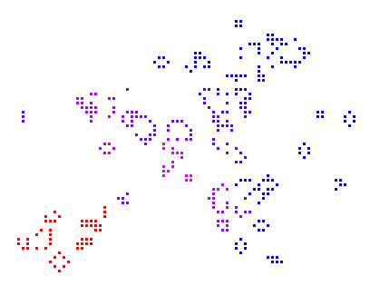
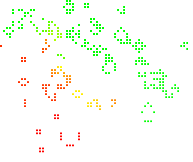

# cgolam [](https://travis-ci.org/mwri/erlang-cgolam)

This is an implementation of Conway's Game of Life, and modifications.
You can run the standard game, but the rules, the display the backend
store and even the initialisation routines can be swapped out by using
alternative callback modules.

## Running the standard game

Start the application amd start a standard game like this:

```erlang
1> ok = application:start(cgolam).
ok
2> cgolam:start([{width, 100}, {height, 100}]).
{ok,<0.83.0>}
3>
```

Start a version of the standard game but using colours, like this:

```erlang
cgolam:start([
    {title, "Coloured Conway's Game of Life"},
    {interval, 50},
    {rules, cgolam_rules_coloured, []},
    {field, cgolam_field_ets, []},
    {width, 150}, {height, 150},
    {display, cgolam_display_wx, [{sqsize, 5}]},
    {init, cgolam_rules_coloured, default, [{cluster_size, 150}]}
]).
```

This looks like different species competing and interbreeding, but
the rules are the same as the standard game, so they are cooperative
really.

## Multiple species

To see an attempt at a true multi species varient, try this one:

```erlang
cgolam:start([
    {title, "UNcooperative multi species CGoL varient"},
    {interval, 50},
    {rules, cgolam_rules_species3, [{colmatch_algorithm, common_duo}]},
    {field, cgolam_field_ets, []},
    {width, 150}, {height, 150},
    {display, cgolam_display_wx, [{sqsize, 5}]},
    {init, cgolam_rules_species3, default, [
        {cluster_size, 300},
        {cluster_density, 100},
        {clusters, 3}
    ]}
]).
```

A bit like CGoL generally, it's not so much a life simulation as a
curious demonstration of emergent behaviour, it's difficult to say
if this exhibits any real competition, but there are elements of that
inherent to this `cgolam_rules_species3` algorithm certainly.

A single colour will perform entirely according the the CGoL rules
but when multiple colours colide, like the coloured version above the
results can be a colour combination... but the difference here is that
the colours are actually entirely independent from each other and a
colour merge only occurs when there is competition for a common cell
(i.e. in a given game cycle two different colours both want to occupy
the same cell), where as two colours can in fact operate along side
one another without having any affect on each other at all IF they
never compete...

What constitutes the same colour is a tricky thing, if an exact match
is required then the chances of a new colour establishing are small
so some tolerance tends to result in more interesting simulations.

For a non tolerant version of the above try this:

```erlang
cgolam:start([
    {title, "UNcooperative multi species CGoL varient"},
    {interval, 50},
    {rules, cgolam_rules_species3, [{colmatch_algorithm, intolerant_duo}]},
    {field, cgolam_field_ets, []},
    {width, 150}, {height, 150},
    {display, cgolam_display_wx, [{sqsize, 5}]},
    {init, cgolam_rules_species3, default, [
        {cluster_size, 300},
        {cluster_density, 100},
        {clusters, 3}
    ]}
]).
```

In many ways the simple coloured version looks more interesting, though
I think the 'species' versions are intellectually more so.

## Running games when the app starts

The `games` application env variable is a list, and adding lists of properties
to it will cause games to be run on application start, for example:

```erlang
{application, cgolam, [
    {description, "Conways Game of life, And modifications"},
    {vsn, "0.9.0"},
    {registered, [
        cgolam_sup,
        cgolam_game_sup
    ]},
    {applications, [
        kernel,
        stdlib,
        sasl
    ]},
    {mod, {cgolam_app, []}},
    {env, [
        {games, [
            [{title, "Coloured Conway's Game of Life"},
                {interval, 50},
                {rules, cgolam_rules_coloured, []},
                {field, cgolam_field_ets, []},
                {width, 150}, {height, 150},
                {display, cgolam_display_wx, [{sqsize, 5}]},
                {init, cgolam_rules_coloured, default, [{cluster_size, 150}]}
                ],
            [{title, "Coloured Conway's Game of Life"},
                {interval, 50},
                {rules, cgolam_rules_coloured, []},
                {field, cgolam_field_ets, []},
                {width, 150}, {height, 150},
                {display, cgolam_display_wx, [{sqsize, 5}]},
                {init, cgolam_rules_coloured, default, [{cluster_size, 150}]}
                ]
            ]}
    ]}
]}.
```

## Other game specification properties

There are a variety of other supported properties.

### rules

Rules allows you to set the rules callback module and any associated config.

Use either `{rules, RulesModule, RulesConfig}` or `{rules, RulesModule}`.
The default `RulesModule` is cgolam_rules_normal, with `[]` default config.

Another rules implementation is `cgolam_rules_coloured`, which, as noted
above, also implements Conway's Game of Life, but uses different colours
for the cells, with new cells (becoming alive from dead) assuming a colour
mix of the surrounding cells.

&nbsp;&nbsp;&nbsp;&nbsp;

### field

The 'field' is the back end storage of the game state. Use `{field, FieldModule, FieldConfig}`
or `{field, FieldModule}`. The default `FieldModule` is `cgolam_rules_ets` with `[]`
default config. You should have no reason to change this though `cgolam_rules_gb_trees`
and `cgolam_rules_tuples` also exist.

### init

The 'init' property sets the field initialisation module and any associated config.
This defaults to the rules module (which initialises the field with data appropriate
to the rules) but an alternative can be specified, and alternative types of initialisation
can be specified if supported too.

Use `{init, InitModule, InitType, InitConfig}` or `{init, InitModule, InitType}`.
The default `InitType` is `default` (atom) and `InitConfig` defaults to `[]` with
supported properties being entirely dependent on the module.

The `cgolam_rules_normal` and `cgolam_rules_coloured` rules modules `default`
initialisations both support `cluster_size` and `cluster_density` which are both
percentage numbers (100 default) affecting the size and density of the initial
clusters respectively (50 means half, 200 means double, etc). Both also support
`clusters`, which defaults to 3 and 4 for `cgolam_rules_normal` and
`cgolam_rules_coloured` respectively.

The 'display' property sets the display module and any associated config.
The only one currently available is `cgolam_display_wx`, thus it is the
default. Use `{display, cgolam_display_wx, DisplayConfig}` or
`{display, cgolam_display_wx}`. The default `DisplayConfig` is `[]`
but `{sqsize, N}` may be given to set the square size.

## Licensing

Copyright 2018 Michael Wright <mjw@methodanalysis.com>

'cgolam' is free software, you can redistribute it and/or modify
it under the terms of the MIT license.
